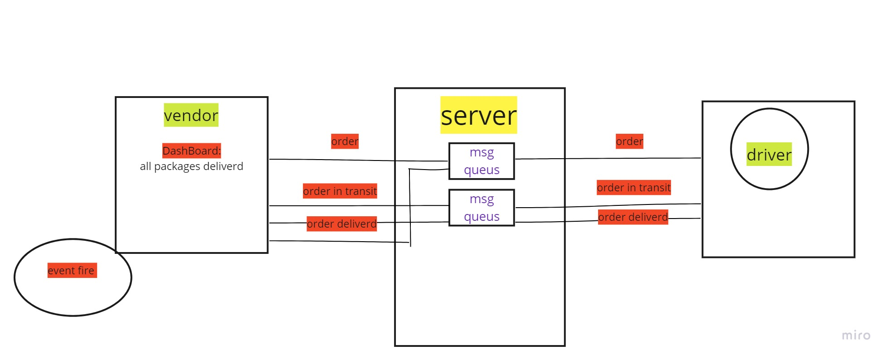

# caps /lab11
* its an Event Driven Applications 
## Deployment Test
- BACKEND: https://github.com/HaninHaidrah/caps 
- PULL request: https://github.com/HaninHaidrah/caps/pull/1  
- The Output: 
- The Test :

## SET UP:
- npm i faker

## Running the app:
- nodemon manage.js

## Tests:
npm run test

## UML 
